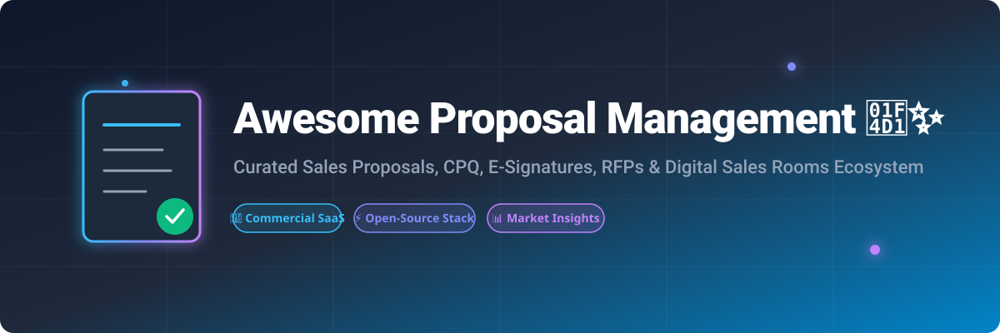

# 📑 Awesome Proposal Management & Sales Automation Ecosystem 💼✨

  

## 🚀 Overview & Ecosystem Guide

Welcome to the **Awesome Proposal Management & Sales Automation Ecosystem** repository! 🌟 This curated list tracks top-tier **Commercial SaaS Platforms**, **Configure Price Quote (CPQ) tools**, **RFP Response Automation systems**, and **Open-Source Software** designed to streamline document creation, client deal rooms, electronic signatures, and sales workflow management.

Whether you are a B2B sales leader, proposal manager, freelance agency, or developer building custom document workflows, this guide provides empirical market intelligence, valuation data, pricing structures, and open-source alternatives.

---

## 💡 Market Dynamics & Sector Analysis

- **Estimated Global Market Size:** The global Proposal Management & Document Automation Software market is estimated at **~$3.5 Billion (2026)** and is projected to expand at a compound annual growth rate (CAGR) of over **14.5%** through 2030, driven by remote deal-closing demand and AI-powered RFP automation.
- **Sector Fragmentation:** The market is **moderately fragmented**. While category leaders like **PandaDoc** ($1B+ valuation) and **Responsive / Loopio** command significant market share in the SMB and enterprise segments respectively, numerous specialized platforms thrive across niche verticals (interactive web proposals, digital sales rooms, agency quotes). It is **not a strict winner-take-all sector**, allowing both commercial innovators and open-source frameworks to coexist effectively.

---

## 📋 Table of Contents

- [🚀 Overview & Ecosystem Guide](#-overview--ecosystem-guide)
- [💡 Market Dynamics & Sector Analysis](#-market-dynamics--sector-analysis)
- [💼 Commercial SaaS Platforms](#-commercial-saas-platforms)
- [⚡ Open-Source GitHub Projects](#-open-source-github-projects)
- [🤝 How to Contribute](#-how-to-contribute)
- [📜 Disclaimer](#-disclaimer)
- [⭐ Star History](#-star-history)

---

## 💼 Commercial SaaS Platforms

Below is a comparative breakdown of commercial proposal and contract management platforms, sorted in descending order by **company size, ARR, and enterprise valuation**:

| Platform | Description | Company Size / Valuation / ARR | Pricing (Starting Tier) | Free Tier / Free Trial Limits |
| :--- | :--- | :--- | :--- | :--- |
| **[PandaDoc](https://www.pandadoc.com/)** 🦄 | All-in-one proposal, contract, and e-signature platform with templates, content library, and CRM integrations. | **Unicorn Status** (~$1.0B Valuation, ~$100M ARR, 850+ employees) | $19/user/month (Starter tier, billed annually) | Free eSign Plan (up to 5 documents/month, 2 recipients/doc, 5 templates) & 14-day free trial |
| **[Responsive](https://www.responsive.io/)** 🏢 *(formerly RFPIO)* | Enterprise RFP and proposal response platform centered on content libraries, AI, and response automation. | **Enterprise Leader** (~$500M+ Valuation, ~$50M+ ARR, 500+ employees) | Custom quote-based pricing (Est. ~$6,500/year platform base) | No free plan; No public free trial (custom sales demo required) |
| **[Loopio](https://www.loopio.com/)** 📈 | RFP response and proposal management platform centered on content libraries, AI collaboration, and sales win-rate optimization. | **Mid-Market Leader** (~$200M+ Valuation / $100M+ PE Backed, 250+ employees) | Custom quote-based pricing (Est. ~$20,000/year starting package) | No free plan; No free trial (sales demo required) |
| **[Proposify](https://www.proposify.com/)** 🎯 | Proposal software focused on sales teams, offering content control, workflow approval, and deal analytics. | **Established SaaS** (~$15M–$25M ARR, 100+ employees) | $19/user/month (Basic tier) | No free plan; 14-day free trial of Team plan |
| **[Qwilr](https://qwilr.com/)** 🌐 | Interactive web-based proposal platform that turns flat quotes into responsive, interactive web pages. | **Growth Stage** (~$10M–$20M ARR, 75+ employees) | $35/user/month (Starter tier, billed annually) | No free plan; 14-day free trial |
| **[GetAccept](https://www.getaccept.com/)** 📹 | Digital sales room and proposal platform combining dynamic documents, personalized video, live chat, and e-signatures. | **Growth Stage** (~$10M–$15M ARR, 90+ employees) | $25/user/month (eSign tier) | No free plan; 14-day free trial |
| **[ClientPoint](https://www.clientpoint.com/)** 💼 | Enterprise proposal and sales document platform for creating, sending, and tracking client-facing materials. | **Established SMB** (~$5M–$10M ARR, 50+ employees) | $42/month (Small Business tier) | No standard free plan; Contact sales for custom trial access |
| **[Better Proposals](https://betterproposals.io/)** ⚡ | Simple, fast proposal tool designed for quick creation, instant sending, and e-signature of professional proposals. | **Bootstrapped / SMB** (~$3M–$7M ARR, 25+ employees) | $13/user/month (Starter tier) | No free plan; 14-day free trial |
| **[Nusii](https://www.nusii.com/)** 🎨 | Lightweight proposal software built for freelancers and creative agencies to create, send, and track proposals. | **Niche / Boutique** (~$1M–$3M ARR, <15 employees) | $29/month (Freelancer tier, up to 5 active proposals) | No free plan; 14-day free trial (no credit card required) |

---

## ⚡ Open-Source GitHub Projects

While polished all-in-one commercial deal rooms are predominantly SaaS products, powerful **open-source building blocks** exist for self-hosted document management, PDF generation, electronic signatures, and template rendering.

Below are top open-source projects sorted by **GitHub Star Count (descending)**:

| Project / Repository | Description | Category | Stars |
| :--- | :--- | :--- | :--- |
| **[Stirling-Tools/Stirling-PDF](https://github.com/Stirling-Tools/Stirling-PDF)** | Robust locally-hosted web-based PDF manipulation tool for splitting, merging, converting, and signing proposals. | PDF Generation & Editing |  |
| **[typst/typst](https://github.com/typst/typst)** | Modern markup-based document compiler built in Rust; faster and more readable than LaTeX for generating beautiful PDF proposals. | Document Compilation |  |
| **[paperless-ngx/paperless-ngx](https://github.com/paperless-ngx/paperless-ngx)** | Community-driven document management system that indexes, tags, and versions proposal templates and signed contracts. | Document Management |  |
| **[documenso/documenso](https://github.com/documenso/documenso)** | Open-source alternative to DocuSign and PandaDoc e-signatures, providing self-hosted document signing workflows. | E-Signatures & Document Signing |  |
| **[foliojs/pdfkit](https://github.com/foliojs/pdfkit)** | JavaScript PDF generation library for Node and browser to programmatically build custom quotes and invoices. | PDF Generation Library |  |
| **[open-pdf-sign/open-pdf-sign](https://github.com/open-pdf-sign/open-pdf-sign)** | Open-source CLI and library to digitally sign PDF documents with qualified electronic signatures (X.509 certificates). | E-Signatures & PDF Security |  |

### 🛠️ Architecture Blueprint for Custom Open-Source Proposals

If you prefer building a custom self-hosted proposal pipeline:
1. **Content Repository & Storage:** Store modular proposal templates and clauses in **Paperless-ngx** or Markdown/Git repositories.
2. **Document Rendering Engine:** Compile dynamic quotes and PDFs using **Typst** or **PDFKit**.
3. **Electronic Signature Execution:** Collect legal signatures securely via **Documenso** or **Open-PDF-Sign**.
4. **Processing & PDF Utilities:** Handle PDF page merging, watermarking, and compression via **Stirling-PDF**.

---

## 🤝 How to Contribute

We welcome contributions from sales ops engineers, developers, and founders! To contribute:

1. 🍴 Fork this repository.
2. 📝 Add or update entries in `README.md` maintaining table formatting.
3. 🔗 Ensure all links, pricing tiers, star counts, and metrics are accurate and verifiable.
4. 🔀 Submit a Pull Request with a short summary of your addition.

---

## 📜 Disclaimer

- This document is a **community-curated index** intended for educational and market research purposes.
- Product names, logos, valuations, and trademarks belong to their respective corporate owners.
- Ensure compliance with local contract laws, GDPR, and security standards when deploying open-source document signature pipelines.

---

## ⭐ Star History

---

  <b>Made with ❤️ for sales teams, agencies, and open-source developers worldwide.</b>

